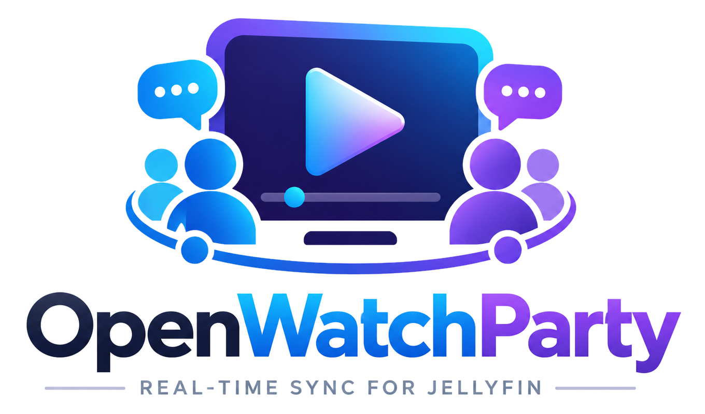
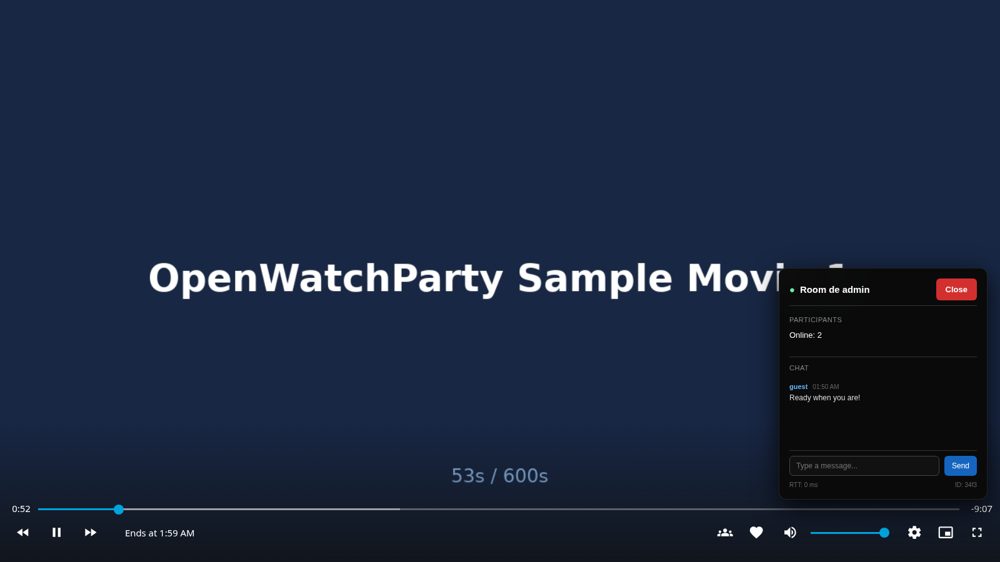

<p align="center">
  
</p>

<p align="center">
  <strong>Watch movies together, no matter the distance.</strong>
</p>

<p align="center">
  <a href="https://github.com/mhbxyz/OpenWatchParty/actions/workflows/ci.yml"></a>
  
  
  
</p>

---

OpenWatchParty enables synchronized media playback for [Jellyfin](https://jellyfin.org/). It consists of a **Jellyfin Plugin** (C#) that integrates the UI and a **Session Server** (Rust) that manages rooms and synchronization via WebSocket.

<p align="center">
  
</p>

## Quick Start

### Users

Already running Jellyfin? Follow the [illustrated first watch-party tutorial](https://mhbxyz.github.io/OpenWatchParty/product/first-watch-party/) to install the plugin and session server, verify them, and invite a second user. The server needs authentication configured on **both** sides; starting its container alone is not a complete installation.

### Developers

```bash
git clone https://github.com/mhbxyz/OpenWatchParty.git
cd OpenWatchParty
just up
```

See the [Development Setup Guide](https://mhbxyz.github.io/OpenWatchParty/development/setup/) and then the [illustrated two-user walkthrough](https://mhbxyz.github.io/OpenWatchParty/product/first-watch-party/#host-create-a-room).

## Documentation

**[mhbxyz.github.io/OpenWatchParty](https://mhbxyz.github.io/OpenWatchParty/)**

## Contributing

- [Report bugs](https://github.com/mhbxyz/OpenWatchParty/issues)
- [Submit pull requests](https://github.com/mhbxyz/OpenWatchParty/pulls)
- [Contributing Guide](CONTRIBUTING.md)

## License

MIT
